# OpenRAG 🚀

**OpenRAG** は、独自のドキュメントに基づいた対話型AI環境をローカルかつ無料で構築できる、オープンソースのマルチモーダルRAGプラットフォームです。

ユーザー認証、ワークスペース管理、ゲストモードなどの機能を備え、個人利用からチームでのナレッジ共有まで幅広く対応可能です。

---

## ✨ 主な機能

- **ユーザー認証**: JWTベースの安全な認証機能（登録・ログイン）。
- **ワークスペース管理**: プロジェクトや講義ごとにドキュメントを分離・整理。
- **ドキュメントアップロード**: PDF, DOCX, TXTに対応。AIの知識源として利用可能。
- **RAGチャット**: アップロード文書に基づき、根拠付きでAIが質問に回答。
- **ゲストモード**: ログイン不要の試用モード。
- **マイクロサービス構成**: GoとPythonを組み合わせたスケーラブルな設計。

---

## 🏛️ システム構成

```mermaid
graph TD
    subgraph "ユーザー"
        User["👤 ユーザー"]
    end

    subgraph "フロントエンド (Docker)"
        Frontend["🖥️ Streamlit UI\nlocalhost:8501"]
    end

    subgraph "バックエンド (Docker)"
        ApiGo["🧩 Go API (Gin) \n 認証・管理"]
        RagPython["🧠 Python RAG API (FastAPI)\nEmbedding・LLM連携"]
    end

    subgraph "データストア (Docker)"
        MySQL["🗄️ MySQL \n ユーザー・設定情報"]
        ChromaDB["📦 ChromaDB\nベクトルデータ"]
    end

    subgraph "外部サービス"
        Gemini["🤖 Google Gemini API"]
    end

    User -->|HTTPS| Frontend
    Frontend -->|APIリクエスト| ApiGo
    Frontend -->|APIリクエスト| RagPython
    ApiGo -->|CRUD| MySQL
    RagPython -->|検索| ChromaDB
    RagPython -->|応答生成| Gemini
```



### 各コンテナの役割

| コンテナ名                | ポート    | 機能概要                    |
| -------------------- | ------ | ----------------------- |
| `frontend-streamlit` | 8501   | ユーザーインターフェース（Streamlit） |
| `api-go`             | 8000   | 認証・ユーザー管理・チャット履歴管理      |
| `rag-python`         | 8001   | RAG処理・Embedding・LLM連携   |
| `db`                 | 3306   | MySQL データベース            |
| `chroma`             | 8002\* | ベクトルデータベース（ChromaDB）    |

\*ポート番号は必要に応じて調整

---

## 🛠️ 技術スタック

* **フロントエンド**: Streamlit
* **バックエンド**:

  * Go + Gin（認証・APIゲートウェイ）
  * Python + FastAPI（RAG処理）
* **ドキュメント検索**: LangChain, Sentence Transformers, ChromaDB
* **LLM**: Google Gemini API
* **インフラ**: Docker, Docker Compose

---

## 🚀 セットアップ手順

### 前提条件

* [Docker](https://www.docker.com/)
* [Docker Compose](https://docs.docker.com/compose/)
* [Google Gemini API キー](https://ai.google.dev/)

### 1. リポジトリのクローン

```bash
git clone <repository_url>
cd OpenRAG
```

### 2. `.env` ファイルの作成

プロジェクトルートに `.env` を作成し、以下の内容を参考に環境変数を設定します。

```env
# .env
MYSQL_DATABASE=open_rag_db
MYSQL_USER=rag_user
MYSQL_PASSWORD=rag_password
MYSQL_ROOT_PASSWORD=rag_root_password
DB_SOURCE=rag_user:rag_password@tcp(db:3306)/open_rag_db?parseTime=true

SERVER_ADDRESS=0.0.0.0:8000
JWT_SECRET_KEY=your-super-secret-jwt-key
GEMINI_API_KEY=your-gemini-api-key

API_GO_URL=http://api-go:8000
API_PYTHON_RAG_URL=http://rag-python:8001
```

### 3. データディレクトリの作成（永続化用）

```bash
mkdir -p data/mysql data/chroma .cache/huggingface
```

### 4. Docker イメージのビルド

```bash
docker compose build
```

### 5. コンテナの起動

```bash
docker compose up -d
```

* バックグラウンド実行（ログを見るには `docker compose logs -f`）

---

## 🌐 アクセス

* **Streamlit UI**: [http://localhost:8501](http://localhost:8501)
* **Go API**: [http://localhost:8000](http://localhost:8000)
* **RAG Python API (FastAPI docs)**: [http://localhost:8001/docs](http://localhost:8001/docs)

---

## 🛑 停止と削除

```bash
docker compose down
```

* `-v` を付けるとボリュームも削除されます（永続化データを完全削除）:

```bash
docker compose down -v
```

---

## 📄 ライセンス

このプロジェクトは [MITライセンス](LICENSE) のもとで公開されています。
